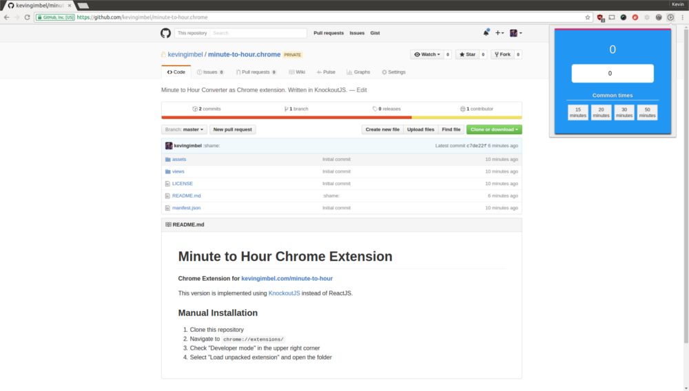

# Minute to Hour Chrome Extension
##### Chrome Extension for [kevingimbel.com/minute-to-hour](http://kevingimbel.com/minute-to-hour/)
This version is implemented using [KnockoutJS](http://knockoutjs.com/) instead of ReactJS.

## Installation

### Chrome Web Store

You can grab the Extension [from the Chrome Webstore](https://chrome.google.com/webstore/detail/minute-to-hour/obaikajlkkoedmedkglnpdailmoeaccm). This will install the latest release pushed to Chrome Web Store.

### Manual Installation

If you prefer to use bleeding edge versions you can download the source from Github by cloning this repository. `master` will always be the latest released version while the `dev` branch holds the latest experimental features.

1. Clone this repository
2. Navigate to `chrome://extensions/`
3. Check "Developer mode" in the upper right corner
4. Select "Load unpacked extension", then open this folder

If manually installed the version can be switched by changing the branch. So if `dev` is to buggy, go into the directory and run `git checkout master`.
